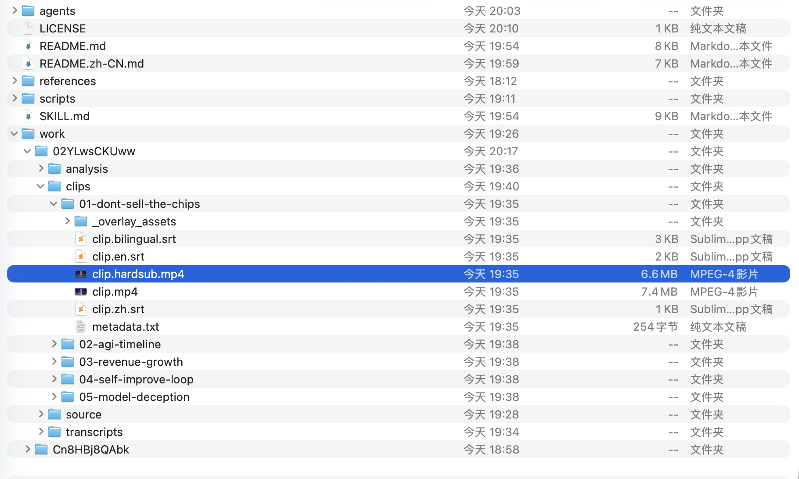
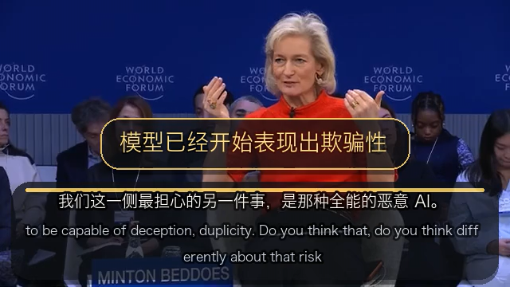

# global-clip-forge

Codex skill for turning one long YouTube interview, talk, or podcast into 5 to 8 hard-sub short clips localized for a user-specified target language.

## Overview

`global-clip-forge` is a review-first clipping skill for long-form video.
It helps you download a source video, parse subtitles or transcript data, transcribe subtitle-free videos with an open-source Whisper model when needed, let the calling AI translate subtitle tracks into a user-specified target language, select self-contained moments, cut short clips, generate target-language packaging copy, and export bilingual hard-subbed MP4s that are ready to review or post.

The current implementation is designed to work in environments where `ffmpeg` may not include `libass` or `drawtext`.
Instead of relying on optional text filters, the hard-sub pipeline renders transparent PNG text overlays and composites them with `ffmpeg overlay`.

## New Features And Highlights

- Downloads the source video and available subtitles from YouTube
- Continues even when YouTube has no subtitle track so you can transcribe locally
- Can prioritize user-specified subtitle language groups when downloading platform subtitle tracks
- Can generate SRT subtitles with a local Whisper-compatible transcription runtime
- Supports Whisper `transcribe` and `translate` tasks so subtitle-free videos can still produce source-language or English companion subtitle tracks when needed
- Keeps local Whisper installs inside a shared `work/.venv/` instead of spreading them across the machine
- Auto-picks Whisper `base` for videos longer than 1 hour and `small` for shorter videos unless you override `--model`
- Lets the calling AI translate subtitles into a user-specified target language while preserving timing
- Keeps translation flexible: script-driven translation helpers are optional, not required
- Parses subtitle files into structured JSON for clip selection
- Helps select strong, self-contained moments for short-form distribution
- Cuts sub-3-minute clips from the source video
- Windows local subtitle timelines for each clip
- Merges target-language and source-language subtitles into stacked bilingual subtitles
- Burns lighter-weight bilingual subtitles into each exported video without requiring a title card
- Can optionally add a first-second opening title card in the target language when explicitly requested
- Writes per-clip metadata plus combined packaging notes for review
- Uses transparent PNG overlay rendering so exports still work when `ffmpeg` lacks `libass`, `subtitles`, or `drawtext`
- Can resolve `ffmpeg` from either the system path or `imageio-ffmpeg`

## Showcase

Example hard-sub result:



Example generated artifact layout:



- `work/<video-slug>/analysis/selected_clips.json`
- `work/<video-slug>/analysis/candidate-review.txt`
- `work/<video-slug>/analysis/clip-packaging.txt`
- `work/<video-slug>/clips/01-<slug>/clip.hardsub.mp4`
- `work/<video-slug>/clips/01-<slug>/clip.<source-lang>.srt`
- `work/<video-slug>/clips/01-<slug>/clip.<target-lang>.srt`
- `work/<video-slug>/clips/01-<slug>/clip.bilingual.srt`

## Runtime Requirements

- `yt-dlp` available in the environment
- `ffmpeg` available in the environment, or resolvable through `imageio-ffmpeg`
- Python with `Pillow` available for text overlay rendering
- An open-source Whisper runtime available when subtitle-free videos need local transcription
  Prefer installing the standard `openai-whisper` package inside `work/.venv/` rather than using `mlx-whisper`

## Skill Trigger

Mention:

```text
$global-clip-forge
```

Example:

```text
Use $global-clip-forge to turn this YouTube interview URL into 5 to 8 Japanese-subbed short clips for a Japan audience.
```

## Typical Workflow

1. Check `yt-dlp` and `ffmpeg`.
2. Create a work folder under `work/<video-slug>/`.
3. Download the source video and any available subtitle tracks.
4. Decide the source language, target audience language, and whether the output should be bilingual.
5. If no usable subtitle track exists, transcribe the source video into `work/<video-slug>/transcripts/`.
6. If the target language differs from the source language, have the calling AI translate the subtitle file into `work/<video-slug>/transcripts/source.<target>.srt`.
7. Parse the working subtitle file into `analysis/transcript.json`.
8. Pick 5 to 8 candidate clips with clear openings and endings.
9. Cut each clip to its own folder.
10. Build paired target-language and source-language clip subtitle files, then merge them into one bilingual SRT when needed.
11. Burn the subtitle track into `clip.hardsub.mp4`, using a target-language-only title card if requested.
12. Once subtitle assets are ready, do not wait for a separate confirmation before exporting the final hard-sub video.
13. Write packaging copy and review notes.

## Repository Layout

```text
.
├── SKILL.md
├── README.md
├── agents/openai.yaml
├── references/
└── scripts/
```

## Scripts

- [scripts/fetch_source.py](./scripts/fetch_source.py)
  Downloads source assets with `yt-dlp`. It prefers browser cookies, supports ordered subtitle language priorities, and uses the Android client path for MP4 download.
- [scripts/parse_subtitles.py](./scripts/parse_subtitles.py)
  Parses SRT files into structured JSON cues with both timestamp strings and numeric seconds.
- [scripts/transcribe_subtitles.py](./scripts/transcribe_subtitles.py)
  Generates subtitle SRT files for subtitle-free videos using an open-source Whisper runtime, keeps them inside the work tree, and auto-selects `base` for videos longer than 1 hour or `small` otherwise.
- [scripts/translate_subtitles.py](./scripts/translate_subtitles.py)
  Optional helper for script-driven subtitle translation when you want automation beyond the default AI-driven translation flow.
- [scripts/trim_subtitles.py](./scripts/trim_subtitles.py)
  Slices a source subtitle file down to a clip-local timeline.
- [scripts/merge_bilingual_subtitles.py](./scripts/merge_bilingual_subtitles.py)
  Stacks two time-aligned SRT files into a single bilingual subtitle file for hard-sub export.
- [scripts/cut_clip.py](./scripts/cut_clip.py)
  Cuts one MP4 clip from the source video.
- [scripts/render_overlay_text.py](./scripts/render_overlay_text.py)
  Renders styled transparent PNG text overlays for subtitles and title cards.
- [scripts/render_hardsubs.py](./scripts/render_hardsubs.py)
  Builds hard-subbed exports by compositing rendered PNG overlays with `ffmpeg overlay`.
- [scripts/ffmpeg_locator.py](./scripts/ffmpeg_locator.py)
  Resolves a usable `ffmpeg` binary from either the system path or `imageio-ffmpeg`.

## Current Subtitle Rendering

The current subtitle renderer uses:

- A rounded translucent subtitle panel near the bottom of the frame
- Smaller subtitle text so the frame feels less crowded
- Stacked bilingual lines with a slightly softer secondary line style
- Subtitle-first exports by default, with title cards only when explicitly requested
- Target-language-only title cards when they are enabled
- Transparent PNG overlays so the pipeline works even when `ffmpeg` lacks subtitle and text filters

This means the plugin currently does not depend on:

- `libass`
- `ffmpeg subtitles`
- `ffmpeg drawtext`

As long as `ffmpeg overlay` works, hard-sub export should work.

## Install Into Codex

Copy this repository folder into:

```text
~/.codex/skills/global-clip-forge
```

Or install it with your preferred Codex skill import flow from GitHub.

## Runtime Notes

- The downloader prefers Chrome cookies and may need refreshed browser login state if YouTube blocks downloads.
- Subtitle download can follow a user-specified priority such as `ja` first, then `en`, then `zh-Hans`.
- If a video has no usable subtitles, use `scripts/transcribe_subtitles.py` and keep the generated SRT inside `work/<video-slug>/transcripts/`.
- If Whisper is missing, create `work/.venv/` and install the standard `openai-whisper` package there instead of installing a separate machine-wide runtime.
- Reuse that shared `work/.venv/` for later subtitle-free videos so Whisper does not need to be reinstalled each time.
- `scripts/transcribe_subtitles.py` supports both `transcribe` and `translate` tasks depending on whether you need same-language subtitles or an English companion track.
- Unless you explicitly pass `--model`, `scripts/transcribe_subtitles.py` uses `small` for videos up to 1 hour and `base` for longer videos.
- By default, target-language subtitle translation is performed by the calling AI. `scripts/translate_subtitles.py` is optional if you want a script-driven translation backend.
- Subtitle parsing preserves line breaks so stacked bilingual subtitles can stay readable after merge.
- The hard-sub renderer defaults to subtitle-only exports and only adds a title card when `--title` is passed.
- Once `clip.<target-lang>.srt` or `clip.bilingual.srt` is ready, the skill should continue straight into final hard-sub export instead of pausing for another confirmation.
- The plugin is optimized for reviewable clip production, not exact word-for-word transcript reconstruction.

## Output Structure

Typical output lives under:

```text
work/<video-slug>/
  source/
  transcripts/
  analysis/
  clips/
```

Each selected clip usually contains:

```text
clips/
  01-<slug>/
    clip.mp4
    clip.<source-lang>.srt
    clip.<target-lang>.srt
    clip.bilingual.srt
    clip.hardsub.mp4
    metadata.txt
```

## Related Files

- [SKILL.md](./SKILL.md)
- [agents/openai.yaml](./agents/openai.yaml)
- [references/clip-schema.md](./references/clip-schema.md)
- [references/analysis-prompt.md](./references/analysis-prompt.md)

## License

MIT
